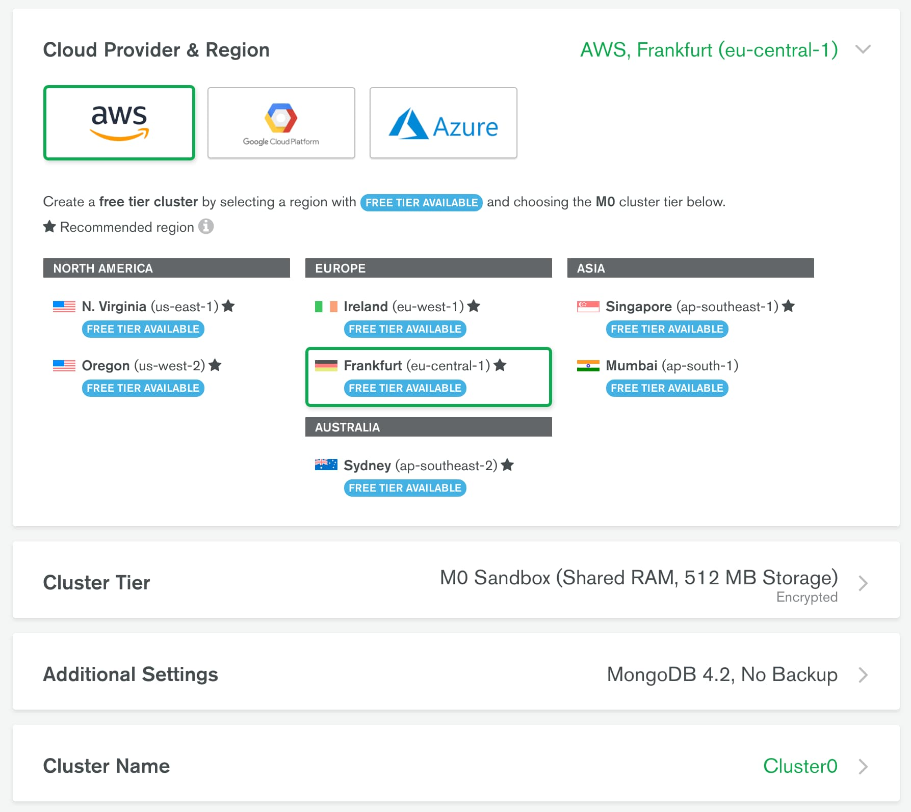
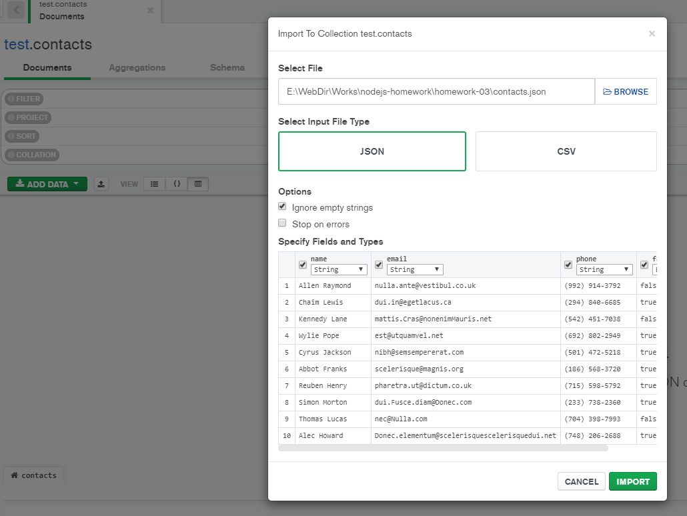
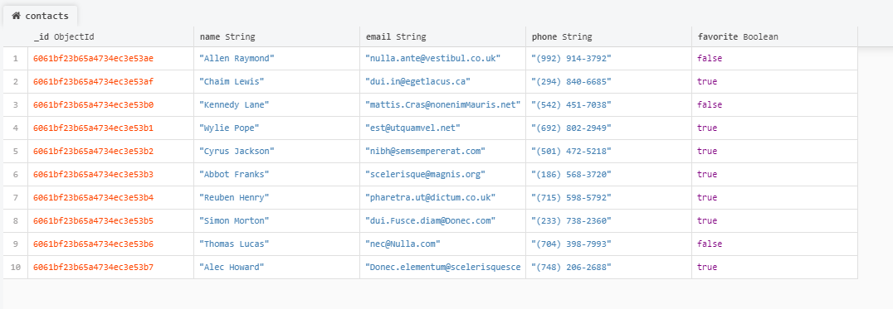

# Домашнє завдання 2

Подивися пояснююче відео як це зробити та здавати ДЗ правильно: [](https://www.youtube.com/watch?v=wabSW_sz_cM ' пояснення')

Написати REST API для роботи з колекцією контактів. Для роботи з REST API використовуй [Postman] (https://www.getpostman.com/).

Прочитай уважно readme в клонованому темплейті, там описаний механізм здачі домашніх завдань. Та починай виконувати ДЗ

## Крок 1

Створи гілку `hw02-express` з гілки master.

Встанови модулі командою

```bash
npm i
```

Такі модулі є в проекті:

- [express](https://www.npmjs.com/package/express)
- [morgan](https://www.npmjs.com/package/morgan)
- [cors](https://www.npmjs.com/package/cors)

## Крок 2

У `app.js` – веб сервер на `express` і прошарки `morgan` та `cors`. Почни налаштовувати раутінг для роботи з колекцією контактів.

REST API повинен підтримувати такі раути.

### @ GET /api/contacts

- нічого не отримує
- викликає функцію `listContacts` для роботи з json-файлом `contacts.json`
- повертає масив всіх контактів в json-форматі зі статусом `200`

### @ GET /api/contacts/:id

- Не отримує `body`
- Отримує параметр `id`
- викликає функцію `getById` для роботи з json-файлом `contacts.json`
- якщо такий `id` є, повертає об'єкт контакту в json-форматі зі статусом `200`
- якщо такого `id` немає, повертає json з ключем `"message": "Not found"` і статусом `404`

### @ POST /api/contacts

- Отримує `body` в форматі `{name, email, phone}` (усі поля обов'язкові)
- Якщо в `body` немає якихось обов'язкових полів, повертає json з ключем `{"message": "missing required name field"}` і статусом `400`
- Якщо з `body` все добре, додає унікальний ідентифікатор в об'єкт контакту
- Викликає функцію `addContact(body)` для збереження контакту в файлі `contacts.json`
- За результатом роботи функції повертає об'єкт з доданим `id` `{id, name, email, phone}` і статусом `201`

### @ DELETE /api/contacts/:id

- Не отримує `body`
- Отримує параметр `id`
- Викликає функцію `removeContact` для роботи з json-файлом `contacts.json`
- якщо такий `id` є, повертає json формату `{"message": "contact deleted"}` і статусом `200`
- якщо такого `id` немає, повертає json з ключем `"message": "Not found"` і статусом `404`

### @ PUT /api/contacts/:id

- Отримує параметр `id`
- Отримує `body` в json-форматі з оновленням будь-яких полів `name, email и phone`
- Якщо `body` немає, повертає json з ключем `{"message": "missing fields"}` і статусом `400`
- Якщо з `body` все добре, викликає функцію `updateContact(contactId, body)`. (Напиши її) для поновлення контакту в файлі `contacts.json`
- За результатом роботи функції повертає оновлений об'єкт контакту і статусом `200`. В іншому випадку, повертає json з ключем `"message": "Not found"` і статусом `404`

## Крок 3

Для маршрутів, що приймають дані (`POST` та ` PUT`), продумайте перевірку (валідацію) отриманих даних. Для валідації прийнятих даних використовуйте пакет [joi](https://github.com/sideway/joi)

## Критерії прийому дз # 2-6

- Створено репозиторій з домашнім завданням &mdash; REST API додаток
- При створенні репозиторія використаний [бойлерплейт](https://github.com/goitacademy/nodejs-homework-template)
- Пулл-реквест (PR) з відповідним дз відправлений менторові в [schoology](https://app.schoology.com/login) на перевірку (посилання на PR)
- Код відповідає технічному завданню проекта
- При виконанні коду не виникає необроблених помилок
- Назва змінних, властивостей і методів починається з малої літери і записуються в нотації CamelCase. Використовуються англійські іменники
- Назва функції або методу містить дієслово
- У коді немає закоментуваних ділянок коду
- Проект коректно працює з актуальною LTS-версією Node

<!-- =================================================== -->

# Домашнє завдання 3

Створи гілку `03-mongodb` з гілки `master`.

Продовж створення REST API для роботи з колекцією контактів.

## Крок 1

Створи аккаунт на [MongoDB Atlas](https://www.mongodb.com/cloud/atlas). Після чого в акаунті створи новий проект і налаштуй **безкоштовний кластер**. Під час налаштування кластера вибери провавйдера і регіон як на скріншоті нижче. Якщо вибрати занадто віддалений регіон, швидкість відповіді сервера буде довше.



## Крок 2

Установи графічний редактор
[MongoDB Compass](https://www.mongodb.com/products/compass) для зручної
роботи з базою даних для MongoDB. Налаштуй підключення своєї хмарної бази даних
до Compass. У MongoDB Atlas не забудь створити користувача з правами
адміністратора.

## Крок 3

Через Compass створи базу даних `db-contacts` і в ній колекцію `contacts`. Візьми [посилання на json](./contacts) і за допомогою Compass наповни колекцію `contacts` (зроби імпорт) його вмістом.



Якщо ви все зробили правильно, дані повинні з'явитися у вашій базі в колекції `contacts`



## Крок 4

Використовуй вихідний код [домашньої роботи #2](../homework-02/README.md) і
заміни зберігання контактів з json-файлу на створену тобою базу даних.

- Напиши код для створення підключення до MongoDB за допомогою [Mongoose](https://mongoosejs.com/).
- При успішному підключенні виведи в консоль повідомлення `"Database connection successful"`.
- Обов'язково обробив помилку підключення. Виведи в консоль повідомлення помилки і заверши процес використовуючи `process.exit(1)`.
- У функціях обробки запитів заміни код CRUD-операцій над контактами з файлу, на Mongoose-методи для роботи з колекцією контактів в базі даних.

Схема моделі для колекції `contacts`:

```js
  {
    name: {
      type: String,
      required: [true, 'Set name for contact'],
    },
    email: {
      type: String,
    },
    phone: {
      type: String,
    },
    favorite: {
      type: Boolean,
      default: false,
    },
  }
```

## Крок 5

У нас з'явилося в контактах додаткове поле статусу `favorite`, яке приймає логічне значення` true` або `false`. Воно відповідає за те, що в обраному чи ні знаходиться зазначений контакт. Потрібно реалізувати для оновлення статусу контакту новий роутер

### @ PATCH /api/contacts/:id/favorite

- Отримує параметр `contactId`
- Отримує `body` в json-форматі з оновленням поля` favorite`
- Якщо `body` немає, повертає json з ключем`{ "message": "missing field favorite"}`і статусом` 400`
- Якщо з `body` все добре, викликає функцію` updateStatusContact (contactId, body)` (напиши її) для поновлення контакту в базі)
- За результатом роботи функції повертає оновлений об'єкт контакту і статусом `200`. В іншому випадку, повертає json з ключем `" message ":" Not found "` і статусом `404`

Для роута `POST /api/contacts` внеси зміни: якщо поле `favorite` не вказали в `body`, то при збереженні в базу нового контакту, зроби поле `favorite` рівним за замовчуванням `false`

<!-- =========================================== -->

# Домашнє завдання 4

Створи гілку `04-auth` з гілки `master`.

Продовж створення REST API для роботи з колекцією контактів. Додай логіку аутентифікації/авторизації користувача через [JWT](https://jwt.io/).

## Крок 1

У коді створи схему і модель користувача для колекції `users`.

```js
{
  password: {
    type: String,
    required: [true, 'Set password for user'],
  },
  email: {
    type: String,
    required: [true, 'Email is required'],
    unique: true,
  },
  subscription: {
    type: String,
    enum: ["starter", "pro", "business"],
    default: "starter"
  },
  token: String
}
```

Змініть схему контактів, щоб кожен користувач бачив тільки свої контакти. Для цього в схемі контактів додайте властивість

```js
    owner: {
      type: Schema.Types.ObjectId,
      ref: 'user',
    }
```

Примітка: `'user'` - назва колекції, у якій зберігаються користувачі

## Крок 2

### Реєстрація

Створити ендпоінт [`/users/register`](#registration-request)

Зробити валідацію всіх обов'язкових полів (email і password). При помилці валідації повернути [Помилку валідації](#registration-validation-error).

У разі успішної валідації в моделі `User` створити користувача за даними, які пройшли валідацію. Для засолювання паролів використовуй [bcrypt](https://www.npmjs.com/package/bcrypt) або [bcryptjs](https://www.npmjs.com/package/bcryptjs)

- Якщо пошта вже використовується кимось іншим, повернути [Помилку Conflict](#registration-conflict-error).
- В іншому випадку повернути [Успішна відповідь](#registration-success-response).

#### Registration request

```shell
POST /users/register
Content-Type: application/json
RequestBody: {
  "email": "example@example.com",
  "password": "examplepassword"
}
```

#### Registration validation error

```shell
Status: 400 Bad Request
Content-Type: application/json
ResponseBody: <Помилка від Joi або іншої бібліотеки валідації>
```

#### Registration conflict error

```shell
Status: 409 Conflict
Content-Type: application/json
ResponseBody: {
  "message": "Email in use"
}
```

#### Registration success response

```shell
Status: 201 Created
Content-Type: application/json
ResponseBody: {
  "user": {
    "email": "example@example.com",
    "subscription": "starter"
  }
}
```

### Логін

Створити ендпоінт [`/users/login`](#login-request)

В моделі `User` знайти користувача за `email`.

Зробити валідацію всіх обов'язкових полів (email і password). При помилці валідації повернути [Помилку валідації](#validation-error-login).

- В іншому випадку, порівняти пароль для знайденого користувача, якщо паролі збігаються створити токен, зберегти в поточному юзера і повернути [Успішна відповідь](#login-success-response).
- Якщо пароль або імейл невірний, повернути [Помилку Unauthorized](#login-auth-error).

#### Login request

```shell
GET /users/login
Content-Type: application/json
RequestBody: {
  "email": "example@example.com",
  "password": "examplepassword"
}
```

#### Login validation error

```shell
Status: 400 Bad Request
Content-Type: application/json
ResponseBody: <Помилка від Joi або іншої бібліотеки валідації>
```

#### Login success response

```shell
Status: 200 OK
Content-Type: application/json
ResponseBody: {
  "token": "exampletoken",
  "user": {
    "email": "example@example.com",
    "subscription": "starter"
  }
}
```

#### Login auth error

```shell
Status: 401 Unauthorized
ResponseBody: {
  "message": "Email or password is wrong"
}
```

## Крок 3

### Перевірка токена

Створи мідлвар для перевірки токена і додай його до всіх раутів, які повинні бути захищені.

- Мідлвар бере токен з заголовків `Authorization`, перевіряє токен на валідність.
- У випадку помилки повернути [Помилку Unauthorized](#middleware-unauthorized-error).
- Якщо валідація пройшла успішно, отримати з токена `id` користувача. Знайти користувача в базі даних з цим `id`.
- Якщо користувач існує і токен збігається з тим, що знаходиться в базі, записати його дані в `req.user` і викликати `next()`.
- Якщо користувача з таким `id` НЕ існує або токени не збігаються, повернути [Помилку Unauthorized](#middleware-unauthorized-error)

#### Middleware unauthorized error

```shell
Status: 401 Unauthorized
Content-Type: application/json
ResponseBody: {
  "message": "Not authorized"
}
```

## Крок 4

### Логаут

Створити ендпоінт [`/users/logout`](#logout-request)

Додай в маршрут мідлвар перевірки токена.

- У моделі `User` знайти користувача за `_id`.
- Якщо користувача не існує повернути [Помилку Unauthorized](#logout-unauthorized-error).
- В іншому випадку, видалити токен у поточного юзера і повернути [Успішна відповідь](#logout-success-response).

#### Logout request

```shell
POST /users/logout
Authorization: "Bearer {{token}}"
```

#### Logout unauthorized error

```shell
Status: 401 Unauthorized
Content-Type: application/json
ResponseBody: {
  "message": "Not authorized"
}
```

#### Logout success response

```shell
Status: 204 No Content
```

## Крок 5

### Поточний користувач - отримати дані юзера по токену

Створити ендпоінт [`/users/current`](#current-user-request)

Додай в раут мідлвар перевірки токена.

- Якщо користувача не існує повернути [Помилку Unauthorized](#current-user-unauthorized-error)
- В іншому випадку повернути [Успішну відповідь](#current-user-success-response)

#### Current user request

```shell
GET /users/current
Authorization: "Bearer {{token}}"
```

#### Current user unauthorized error

```shell
Status: 401 Unauthorized
Content-Type: application/json
ResponseBody: {
  "message": "Not authorized"
}
```

#### Current user success response

```shell
Status: 200 OK
Content-Type: application/json
ResponseBody: {
  "email": "example@example.com",
  "subscription": "starter"
}
```

## Додаткове завдання - необов'язкове

- Зробити пагінацію для колекції контактів (GET /contacts?page=1&limit=20).
- Зробити фільтрацію контактів по полю обраного (GET /contacts?favorite=true)
- Оновлення підписки (`subscription`) користувача через ендпоінт` PATCH` `/users`. Підписка повинна мати одне з наступних значень `['starter', 'pro', 'business']`

<!-- ============================================================== -->

# Домашнє завдання 5

Створи гілку `hw05-avatars` з гілки ` master`.

Продовж створення REST API для роботи з колекцією контактів. Додай можливість завантаження аватарки користувача через [Multer] (https://github.com/expressjs/multer).

## Крок 1

Створи папку `public` для роздачі статики. У цій папці зроби папку `avatars`. Налаштуй Express на роздачу статичних файлів з папки `public`.

Поклади будь-яке зображення в папку `public/avatars` і перевір, що роздача статики працює. При переході по такому URL браузер відобразить зображення.

`` `Shell http://locahost:<порт>/avatars/<ім'я файлу з розширенням> `` `

## Крок 2

У схему користувача додай нову властивість `avatarURL` для зберігання зображення.

```shell
{
  ...
  avatarURL: String,
  ...
}
```

- Використовуй пакет [gravatar](https://www.npmjs.com/package/gravatar) для того, щоб при реєстрації нового користувача відразу згенерувати йому аватар по його `email`.

## Крок 3

При реєстрації користувача:

- Створюй посилання на аватарку користувача за допомогою [gravatar](https://www.npmjs.com/package/gravatar)
- Отриманий URL збережи в поле `avatarURL` під час створення користувача

## Крок 4

Додай можливість поновлення аватарки, створивши ендпоінт `/users/avatars` і використовуючи метод` PATCH`.


```shell
# Запит
PATCH /users/avatars
Content-Type: multipart/form-data
Authorization: "Bearer {{token}}"
RequestBody: завантажений файл

# Успішна відповідь
Status: 200 OK
Content-Type: application/json
ResponseBody: {
  "avatarURL": "тут буде посилання на зображення"
}

# Неуспішна відповідь
Status: 401 Unauthorized
Content-Type: application/json
ResponseBody: {
  "message": "Not authorized"
}
```

- Створи папку `tmp` в корені проекту і зберігай в неї завантажену аватарку.
- Оброби аватарку пакетом [jimp](https://www.npmjs.com/package/jimp) і постав для неї розміри 250 на 250
- Перенеси аватарку користувача з папки `tmp` в папку `public/avatars` і дай їй унікальне ім'я для конкретного користувача.
- Отриманий `URL` `/avatars/<ім'я файлу з розширенням>` та збережи в поле `avatarURL` користувача

## Додаткове завдання - необов'язкове

### 1. Написати unit-тести для контролера входу (login/signin)

За допомогою [Jest](https://jestjs.io/ru/docs/getting-started)

- відповідь повина мати статус-код 200
- у відповіді повинен повертатися токен
- у відповіді повинен повертатися об'єкт `user` з 2 полями `email` та `subscription` з типом даних `String`

<!-- ========================================================= -->

# Домашнє завдання 6

Створи гілку `hw06-email` з гілки` master`.

Продовжуємо створення REST API для роботи з колекцією контактів. Додайте верифікацію email користувача після реєстрації за допомогою сервісу [SendGrid](https://sendgrid.com/).

## Як процес верифікації повинен працювати

1. Після реєстрації, користувач повинен отримати лист на вказану при реєстрації пошту з посиланням для верифікації свого email
2. Пройшовши по посиланню в отриманому листі, в перший раз, користувач повинен отримати [Відповідь зі статусом 200](#verification-success-response), що буде мати на увазі успішну верифікацію email
3. Пройшовши по посиланню повторно користувач повинен отримати [Помилку зі статусом 404](#verification-user-not-found)

## Крок 1

### Підготовка інтеграції з SendGrid API

- Зареєструйся на [SendGrid](https://sendgrid.com/).
- Створи email-відправника. Для цього в адміністративній панелі SendGrid зайдіть в меню Marketing в підменю senders і в правому верхньому куті натисніть кнопку "Create New Sender". Заповніть поля в запропонованій формі. Збережіть. Повинен вийти наступний, як на картинці, результат, тільки з вашим email:


На вказаний email має прийти лист верифікації (перевірте спам якщо не бачите листи). Натисніть на посилання в ньому і завершіть процес. Результат повинен зміниться на:


- Тепер необхідно створити API токен доступу. Вибираємо меню "Email API", і підменю "Integration Guide". Тут вибираємо "Web API"


Далі необхідно вибрати технологію Node.js


На третьому кроці даємо ім'я нашого токену. Наприклад, systemcats, натискаємо кнопку згенерувати і отримуємо результат як на скріншоті нижче. Необхідно скопіювати цей токен (це важливо, тому що більше ви не зможете його подивитися). Після цього завершити процес створення токена


- Отриманий API-токен треба додати в `.env` файл в нашому проекті

## Крок 2

### Створення ендпоінта для верифікації email

- додати в модель `User` два поля `verificationToken` і `verify`. Значення поля `verify` рівне `false` означатиме, що його email ще не пройшов верифікацію

```js
{
  verify: {
    type: Boolean,
    default: false,
  },
  verificationToken: {
    type: String,
    required: [true, 'Verify token is required'],
  },
}
```

- створити ендпоінт GET [`/users/verify/:verificationToken`](# verification-request), де по параметру `verificationToken` ми будемо шукати користувача в моделі `User`
- якщо користувач з таким токеном не знайдений, необхідно повернути [Помилку 'Not Found'](#verification-user-not-found)
- якщо користувач знайдений - встановлюємо `verificationToken` в `null`, а поле `verify` ставимо рівним `true` в документі користувача і повертаємо [Успішну відповідь](#verification-success-response)

### Verification request

```shell
GET /users/verify/:verificationToken
```

### Verification user Not Found

```shell
Status: 404 Not Found
ResponseBody: {
  message: 'User not found'
}
```

### Verification success response

```shell
Status: 200 OK
ResponseBody: {
  message: 'Verification successful',
}
```

## Крок 3

### Додавання відправки email користувачу з посиланням для верифікації

При створенні користувача при реєстрації:

- створити `verificationToken` для користувача і записати його у БД (для генерації токена використовуйте пакет [uuid](https://www.npmjs.com/package/uuid) або [nanoid](https://www.npmjs.com/package/nanoid))
- відправити email на пошту користувача і вказати посилання для верифікації email'а ( `/users/verify/:verificationToken`) в повідомленні
- Так само необхідно враховувати, що тепер логін користувача не дозволений, якщо не верифікувано email

## Крок 4

### Додавання повторної відправки email користувачу з посиланням для верифікації

Необхідно передбачити, варіант, що користувач може випадково видалити лист. Воно може не дійти з якоїсь причини до адресата. Наш сервіс відправки листів під час реєстрації видав помилку і т.д.

#### @ POST /users/verify

- Отримує `body` у форматі `{email}`
- Якщо в `body` немає обов'язкового поля `email`, повертає json з ключем `{"message":"missing required field email"}` і статусом `400`
- Якщо з `body` все добре, виконуємо повторну відправку листа з `verificationToken` на вказаний email, але тільки якщо користувач не верифікований
- Якщо користувач вже пройшов верифікацію відправити json з ключем `{"message":"Verification has already been passed"}` зі статусом `400 Bad Request`

#### Resending a email request

````shell
POST /users/verify
Content-Type: application/json
RequestBody: {
  "email": "example@example.com"
}
`` `

#### Resending a email validation error

```shell
Status: 400 Bad Request
Content-Type: application/json
ResponseBody: <Помилка від Joi або іншої бібліотеки валідації>
````

#### Resending a email success response

```shell
Status: 200 Ok
Content-Type: application/json
ResponseBody: {
  "message": "Verification email sent"
}
```

#### Resend email for verified user

```shell
Status: 400 Bad Request
Content-Type: application/json
ResponseBody: {
  message: "Verification has already been passed"
}
```

> Примітка: Як альтернативу SendGrid можна використовувати пакет [nodemailer](https://www.npmjs.com/package/nodemailer)

## Додаткове завдання - необов'язкове

### 1. Напишіть dockerfile для вашої програми
