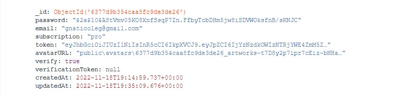
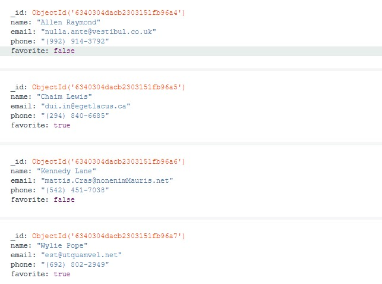

## Backend with user registration and work with his contacts.

### Working with the user:

1. `POST-запрос /api/users/signup` Для регистрации пользователя. Ожидает в теле
   запроса email и password (пароль хэшируется). В ответе приходит эмейл, поле
   "subscription": "starter", сгенерированный аватар, и verification token.
   Пользовутелю отправляется эмейл с сылкой для потвеждения верификации. Если
   пользователь с таким эмейлом уже зарегистрирован прийдет ответ "message":
   "Email in use" и ошибка 409 Conflict.

2. `GET-запрос api/users/verify/:verificationToken` Для верификации пользователя
   (сам токен выдается пользователю при регистрации) приходит ответ "message":
   "Verification successful" с кодом 200 OK. В базе данных verification token
   присваивается значение null. А поле verify становится true.

3. `POST-запрос /api/users/verify` Для повторной отправки письма для верификации
   пользователя. В теле запроса ожидает эмейл пользователя. В ответе приходит
   "message": "Verification email sent" и код 200 OK.

4. `POST-запрос /api/users/login` Для логинизации пользователя. Если
   пользователь не верифицировался в ответ приходит "message": "User:
   gnaticoleg@gmail.com not verified" с кодом 401 Unauthorized. В случае если
   пользователь верицировался ему выдается token и приходит код 200 OK.

5. `GET-запрос /api/users/logout` Для разлогинизации пользователя. Ожидает в
   Authorization токен, если токен прийдет сообщение токен неверный, если все
   удачно прийдет код 204 No Content и токену дается значение null.

6. `GET-запрос /api/users/current` Для получения данных по текущему пользователю
   который залогинен, в ответ приходит эмейл и тип подписки со статусом 200 ОК.
   Доступно только для логиненного пользователя. В случае отправки запроса
   незарегестрированный пользователем прийдет ответ "message": "Not authorized"
   с ошибкой 401: Unauthorized.

7. `PATCH-запрос /api/users ` Для обновление подписки (subscription) Подписка
   должна иметь одно из следующих значений ['starter', 'pro' 'business']) В теле
   ожидает subscription одним из этих значений ['starter', 'pro' 'business']. В
   случае если пользователь не ввел в тело запроса информацию в ответе будет
   "message": "\"subscription\" is required" и код 400 Bad Request. В случае
   успеха пользователь получает всю информацию о себе.

    Доступно только для логиненного пользователя. В случае отправки запроса
    незарегестрированный пользователем прийдет ответ "message": "Not authorized"
    с ошибкой 401: Unauthorized.

8. `PATCH-запрос /api/users/avatars` Для обновления аватарки пользователя (при
   регистрации присваивается атоматически). Ожидает тело form-data с полем
   avatar и самим файлом. Реализовано перемещение файла из папки temp в папку
   public. В ответ приходит "avatarURL": "public\\avatars\\avatar.jpg" c кодом
   200 OK.

    

### Working with contacts:

1.  `GET-запрос /api/contacts ` Для получения всех контактов пользователя.
    Доступно только для зарегестрированного пользователя в ответе приходит {
    "result": [], "page": 1, "limit": 5 } со статусом 200 OK. В случае отправки
    запроса незарегестрированный пользователем прийдет ответ "message": "Not
    authorized" с ошибкой 401: Unauthorized.

2.  `POST-запрос /api/contacts` Для добавления нового контакта. Доступно только
    для зарегестрированного пользователя. Ожидает в теле запроса name, email,
    phone в ответе приходит информация которую ввел пользователь, id, поле
    favorite по умолчанию false, owner контакта, и так же время и дата создания
    и последнего изменения контакта со статусом 201 Created.

```
{
    "name": "John",
    "email": "john@mail.com",
    "phone": "12345678",
    "favorite": false,
    "owner": "6377d9b354caa8fc9de3de26",
    "_id": "6377e04b54caa8fc9de3de52",
    "createdAt": "2022-11-18T19:43:07.792Z",
    "updatedAt": "2022-11-18T19:43:07.792Z"
}
```

В случае отправки запроса незарегестрированный пользователем прийдет ответ
"message": "Not authorized" с ошибкой 401: Unauthorized.

3.  `GET-запрос /api/contacts/:id` Для получения контакта по ID со статусом 200
    OK. Доступно только для зарегестрированного пользователя. В случае отправки
    запроса незарегестрированный пользователем прийдет ответ "message": "Not
    authorized" с ошибкой 401: Unauthorized.

4.  `DELETE-запрос /api/contacts/:id` Для удаления контакта по ID в ответе
    приходит { "message": "contact deleted" } со статусом 200 OK. Доступно
    только для зарегестрированного пользователя. В случае отправки запроса
    незарегестрированный пользователем прийдет ответ "message": "Not authorized"
    с ошибкой 401: Unauthorized.

5.  `PUT-запрос /api/contacts/:id` Для обновления контака по ID. Ожидает в теле
    запроса телефон, имя и эмейл в ответе приходит обновленная информация со
    статусом 200 OK. Доступно только для зарегестрированного пользователя. В
    случае отправки запроса незарегестрированный пользователем прийдет ответ
    "message": "Not authorized" с ошибкой 401: Unauthorized.

6.  `PATCH-запрос /api/contacts/:id/favorite` Для обновления поля favorite у
    контакта по ID. Ожидает в теле запроса boolean в ответе приходит обновленная
    информация со статусом 200 ОК .Доступно только для зарегестрированного
    пользователя. В случае отправки запроса незарегестрированный пользователем
    прийдет ответ "message": "Not authorized" с ошибкой 401: Unauthorized.

7.  `GET-запрос /api/contacts?page=1&limit=20` Для получения всех контактов с
    пагинацией, значения можно подставлять динамические. Доступно только для
    незарегестрированный пользователем прийдет ответ "message": "Not authorized"
    с ошибкой 401: Unauthorized.



### Сommands:

-   `npm start` &mdash; start server in production mode

-   `npm run start:dev` &mdash; server start in development mode (development)

-   `npm run lint` &mdash; start code review with eslint, Necessarily carry out
    before dermal PR and administer all linter breaks

-   `npm lint:fix` &mdash; and re-verification of the linter, but automatic
    corrections of simple pardons
