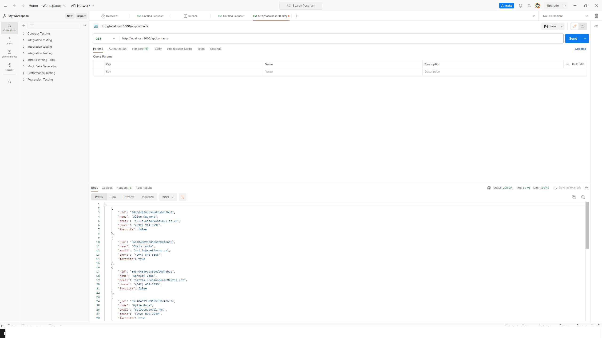
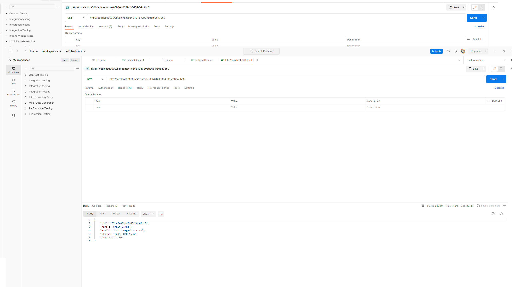
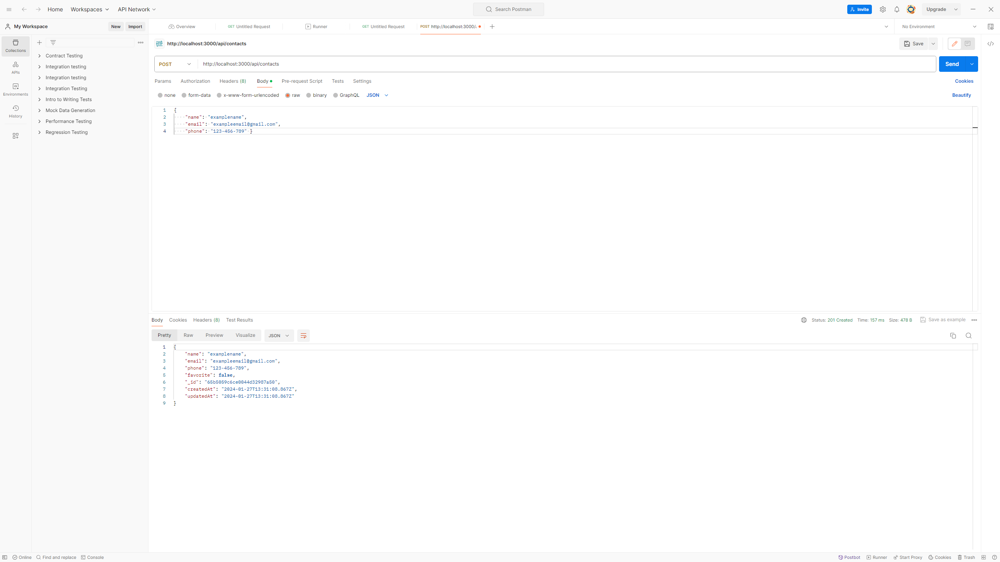
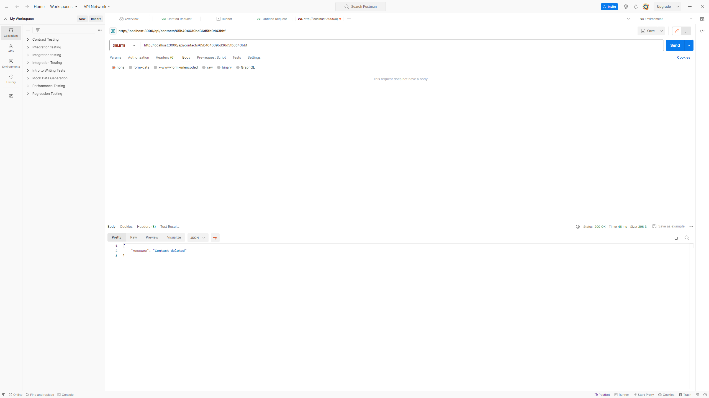
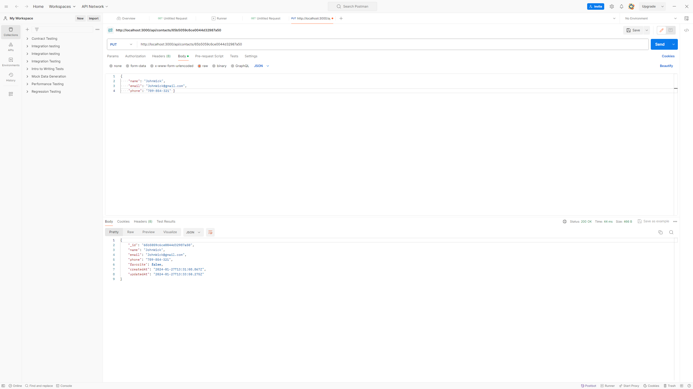
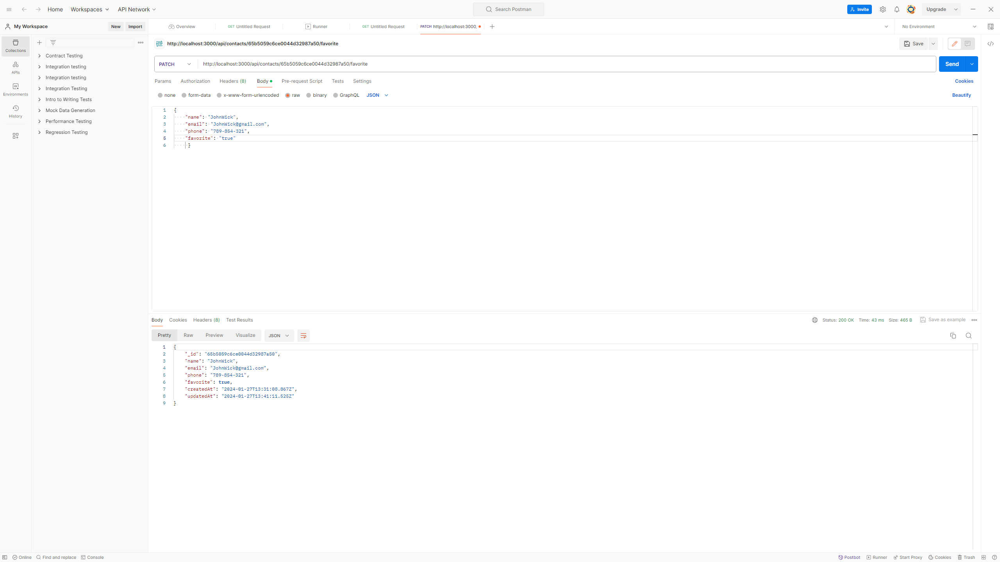

# Installation :

Clone the repository to your local machine: git clone https://github.com/DamianKaczmarczyk/aplikacja-REST-API
Navigate to the project directory: cd goit-node.js-hw-02
Install the dependencies: npm install

# Postman Instructions :

List Contacts:

Set the request type to GET.
Set the request URL to http://localhost:3000/api/contacts.
Click on the "Send" button to retrieve a list of all contacts.

Get Contact by ID:

Set the request type to GET.
Set the request URL to http://localhost:3000/api/contacts/:id (replace :id with the actual contact ID).
Click on the "Send" button to retrieve the specific contact.

Add Contact:

Set the request type to POST.
Set the request URL to http://localhost:3000/api/contacts.
Set the request body to raw JSON with the contact details: { "name": "examplename", "email": "exampleemail@gmail.com", "phone": "123-456-789" }
Click on the "Send" button to add a new contact.

Delete Contact:

Set the request type to DELETE.
Set the request URL to http://localhost:3000/api/contacts/:id (replace :id with the actual contact ID).
Click on the "Send" button to delete the specific contact.

Update Contact:

Set the request type to PUT.
Set the request URL to http://localhost:3000/api/contacts/:id (replace :id with the actual contact ID).
Set the request body to raw JSON with the updated contact details: { "name": "examplename", "email": "exampleemail@gmail.com", "phone": "123 456 789" }
Click on the "Send" button to update the specific contact.

Add to Favorite:

Set the request type to PATCH.
Set the request URL to http://localhost:3000/api/contacts/:id/favorite (replace :id with the actual contact ID).
Set the request body to raw JSON with the updated contact details: { "name": "examplename", "email": "exampleemail@gmail.com", "phone": "123 456 789" "favorite" "true/false"}.
Click on the "Send" button to update the specific contact.

