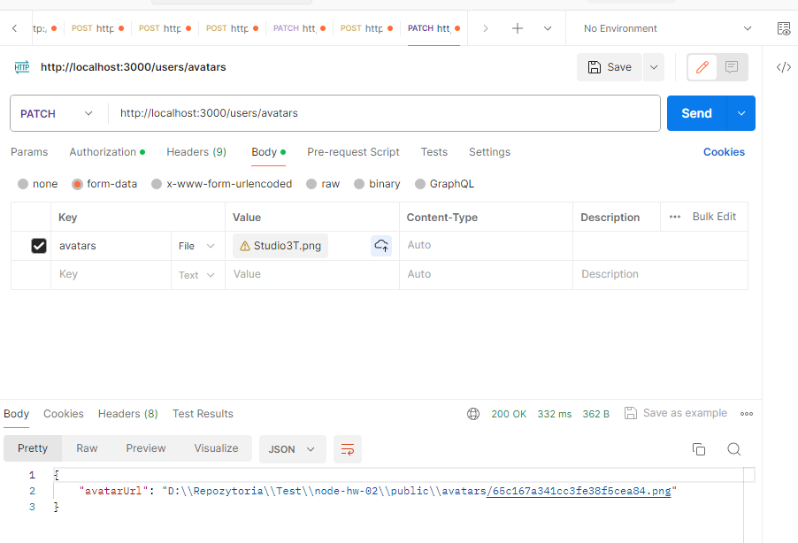

# Node.JS Homework 5 (Working with files and testing )

This task added options to automatically generate an avatar using "gravatar" when creating a new account. Added the ability to change the avatar by uploading the photo to the server thanks to the middleware "multer".  The photo is modified using "jimp" and the new address updates in the database.

---

## How to install

Clone this repo to your desktop and run `npm install` to install all the dependencies.

Rename file `.env-sample` to `.env`

#### Remember never to share passwords

You might want to look into `.env` to make change the port you want to use.

After you clone this repo to your desktop, go to its root directory and run `npm install` to install its dependencies.

Once the dependencies are installed, you can run `npm run start` to start the application. You will then be able to access it at localhost:3000


```shell
npm run start
```
---
## Usage

PATCH - http://localhost:3000/users/avatars - after login, using POSTMAN send photo to server


