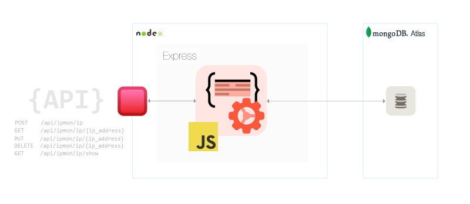

## Node.js Rest Api

### Команди:

- `npm start` &mdash; старт сервера в режимі production
- `npm run start:dev` &mdash; старт сервера в режимі розробки (development)
- `npm run lint` &mdash; запустити виконання перевірки коду з eslint, необхідно
  виконувати перед кожним PR та виправляти всі помилки лінтера
- `npm run lint:fix` &mdash; та ж перевірка лінтера, але з автоматичними
  виправленнями простих помилок
