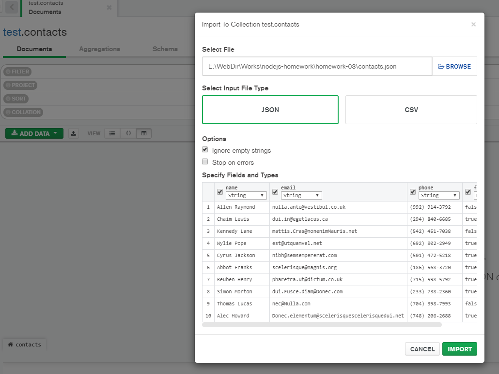
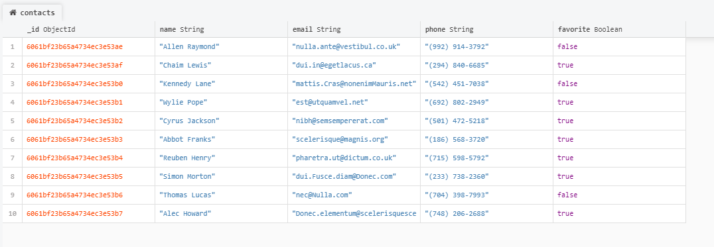

# Домашнее задание 3

Создай ветку `hw03-mongodb` из ветки `master`.

Продолжи создание REST API для работы с коллекцией контактов.

## Шаг 1

Создай аккаунт на [MongoDB Atlas](https://www.mongodb.com/cloud/atlas). После чего в аккаунте создай новый проект и настрой **бесплатный кластер**. Во время настройки кластера выбери провайдера и регион как на скриншоте ниже. Если выбрать слишком удаленный регион, скорость ответа сервера будет дольше.


## Шаг 2

Установи графический редактор [MongoDB Compass](https://www.mongodb.com/download-center/compass) для удобной работы с базой данных для MongoDB. Настрой подключение своей облачной базы данных к Compass. В MongoDB Atlas не забудь создать пользователя с правами администратора.

## Шаг 3

Через Compass создай базу данных `db-contacts` и в ней коллекцию `contacts`. Возьми [ссылка на json](./contacts.json) и при помощи Compass наполни коллекцию `contacts` (сделай импорт) его содержимым.



Если вы все сделали правильно, данные должны появиться в вашей базе в коллекции `contacts`



## Шаг 4

Используйте исходный код [домашней работы #2](../homework-02/README.md) и замените хранение контактов из json-файла на созданную вами базу данных.

- Напишите код для создания подключения к MongoDB при помощи [Mongoose](https://mongoosejs.com/).
- При успешном подключении выведите в консоль сообщение `"Database connection successful"`.
- Обязательно обработайте ошибку подключения. Выведите в консоль сообщение ошибки и завершите процесс используя `process.exit(1)`.
- В функциях обработки запросов замените код CRUD-операций над контактами из файла, на Mongoose-методы для работы с коллекцией контактов в базе данных.

Схема модели для коллекции `contacts`:

```js
  {
    name: {
      type: String,
      required: [true, 'Set name for contact'],
    },
    email: {
      type: String,
    },
    phone: {
      type: String,
    },
    favorite: {
      type: Boolean,
      default: false,
    },
  }
```

## Шаг 5

У нас появилось в контактах дополнительное поле статуса `favorite`, которое принимает логическое значение `true` или `false`. Оно отвечает за то, что в избранном или нет находится указанный контакт. Реализуй для обновления статуса контакта новый маршрут

### @ PATCH /api/contacts/:contactId/favorite

- Получает параметр `contactId`
- Получает `body` в json-формате c обновлением поля `favorite`
- Если `body` нет, возвращает json с ключом `{"message": "missing field favorite"}` и статусом `400`
- Если с `body` все хорошо, вызывает функцию `updateStatusContact(contactId, body)` (напиши ее) для обновления контакта в базе
- По результату работы функции возвращает обновленный объект контакта и статусом `200`. В противном случае, возвращает json с ключом `"message": "Not found"` и статусом `404`

Для роута `POST /api/contacts` внесите изменения: если поле `favorite` не указали в `body`, то при сохранении в базу нового контакта, сделайте поле `favorite` равным по умолчанию `false`. Не забываем про валидацию данных!
