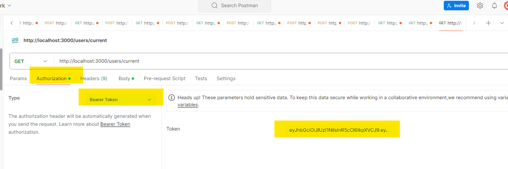

# Node.JS Homework 4 (Authentication and authorization - JWT )

In this task, authentication and authorization were implemented using the "JWT" token of our REST API. For this purpose, "jsonwebtoken", "passport", "passport-jwt" and "bcrypt" were used.

---


## How to install

Clone this repo to your desktop and run `npm install` to install all the dependencies.

Rename file `.env-sample` to `.env`
#### Remember never to share passwords

You might want to look into `.env` to make change the port you want to use.


After you clone this repo to your desktop, go to its root directory and run `npm install` to install its dependencies.

Once the dependencies are installed, you can run  `npm run start` to start the application. You will then be able to access it at localhost:3000

```shell
npm run start 
```

--------------- 
## Usage 

#### Without autorization 
POST - http://localhost:3000/users/register - create new user in database and set hashtagged password in database
POST - http://localhost:3000/users/login - login into account and set JWT in database
#### With authorization 
GET - http://localhost:3000/users/logout - logout and delete JWT from database. 
GET - http://localhost:3000/users/current - get logged user email and subscription


