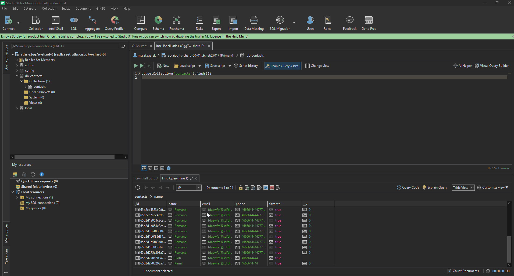

# Node.JS Homework 3 (NoSQL Database - MongoDB)


In this task, a third layer in the form of a database was implemented for our REST API. "MongoDB Atlas", "Studio 3T" and "MongoDB Compass" were used for this.

---


## How to install

Clone this repo to your desktop and run `npm install` to install all the dependencies.

<<<<<<< HEAD
Rename file `.env-sample` to `.env`.
=======
Rename file `.env-sample` to `.env`
>>>>>>> parent of c4a95b6 (Merge pull request #6 from ArkadiuszMyszka/revert-5-hw03-mongodb)

You might want to look into `config.json` to make change the port you want to use and set up a SSL certificate.


## Usage
After you clone this repo to your desktop, go to its root directory and run `npm install` to install its dependencies.

Once the dependencies are installed, you can run  `npm run start` to start the application. You will then be able to access it at localhost:3000

```shell
npm run start 
```
--------------- 
### Queries

You should send your queries, e.g. via the Postman application, to http://localhost:3000/


--------------- 
### MongoDB

Database changes visible with Studio 3T




