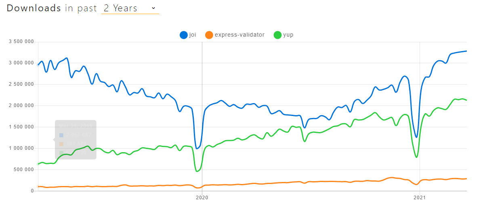
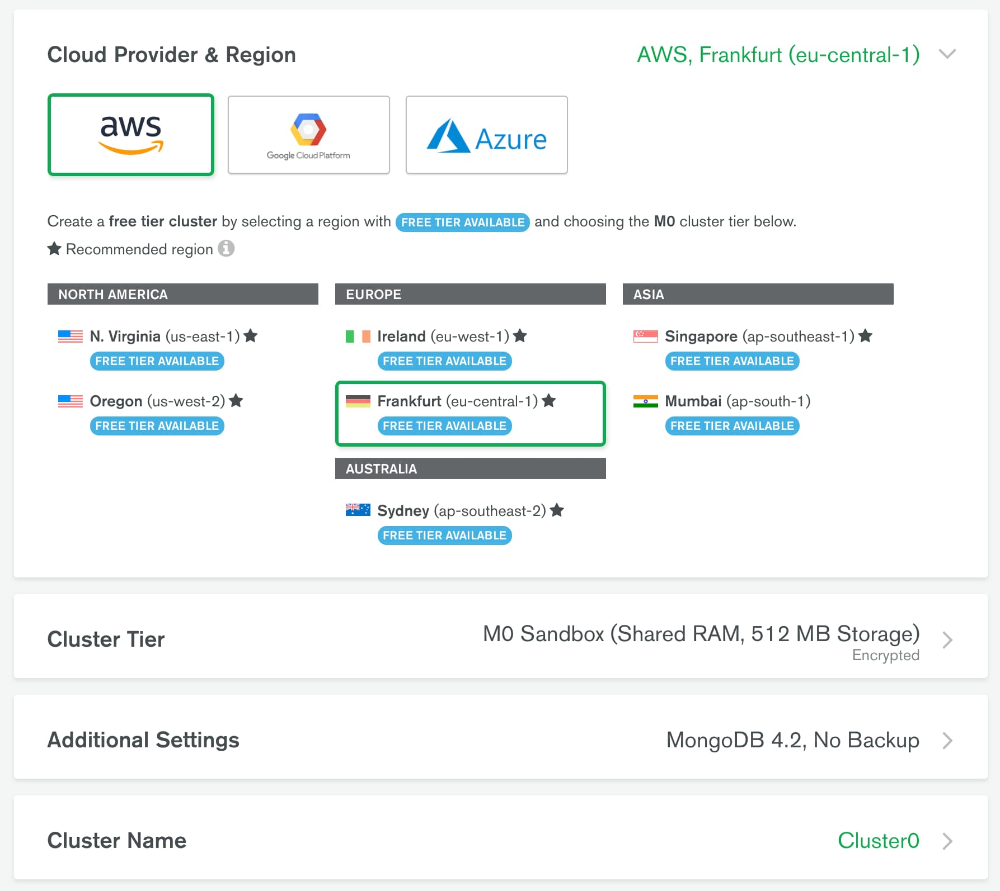
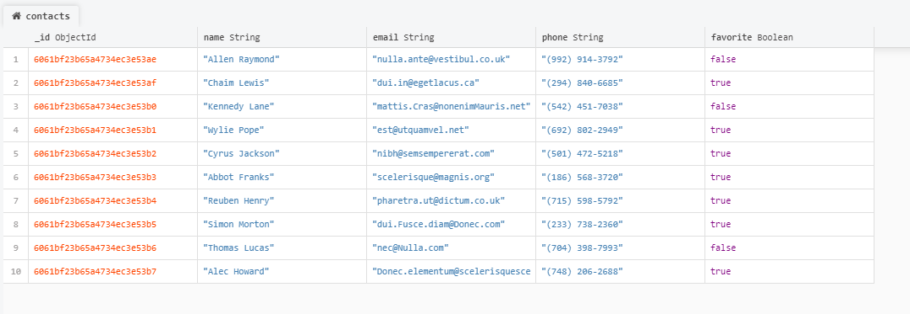

## GoIT Node.js Course Template Homework

Выполните форк этого репозитория для выполнения домашних заданий (2-6)
Форк создаст репозиторий на вашем http://github.com

Добавьте ментора в коллаборацию

Для каждой домашней работы создавайте свою ветку.

- hw02
- hw03
- hw04
- hw05
- hw06

Каждая новая ветка для дз должна делаться с master

После того как вы закончили выполнять домашнее задание в своей ветке, необходимо сделать пулл-реквест (PR). Потом добавить ментора для ревью кода. Только после того как ментор заапрувит PR, вы можете выполнить мердж ветки с домашним заданием в мастер.

Внимательно читайте комментарии ментора. Исправьте замечания и сделайте коммит в ветке с домашним заданием. Изменения подтянуться в PR автоматически после того как вы отправите коммит с исправлениями на github
После исправления снова добавьте ментора на ревью кода.

- При сдаче домашней работы есть ссылка на PR
- JS-код чистый и понятный, для форматирования используется Prettier

### Команды:

- `npm start` &mdash; старт сервера в режиме production
- `npm run start:dev` &mdash; старт сервера в режиме разработки (development)
- `npm run lint` &mdash; запустить выполнение проверки кода с eslint, необходимо выполнять перед каждым PR и исправлять все ошибки линтера
- `npm lint:fix` &mdash; та же проверка линтера, но с автоматическими исправлениями простых ошибок

# Домашнее задание 2

Создай форк [репозитория](https://github.com/goitacademy/nodejs-homework-template) в свой github аккаунт.

Посмотри поясняющее видео как это сделать и сдавать ДЗ правильно: [](https://www.youtube.com/watch?v=wabSW_sz_cM "Пояснение")

Написать REST API для работы с коллекцией контактов. Для работы с REST API используй [Postman](https://www.getpostman.com/).

Прочитай внимательно readme в клонированном бойлерплейте, там описан механизм сдачи домашних заданий. Приступай к выполнению ДЗ

## Шаг 1

Создай ветку `hw02-express` из ветки master.

Установи модули командой:

```bash
npm i
```

Следующие модули уже есть в проекте:

- [express](https://www.npmjs.com/package/express)
- [morgan](https://www.npmjs.com/package/morgan)
- [cors](https://www.npmjs.com/package/cors)

## Шаг 2

В app.js – веб сервер на express, добавлены прослойки `morgan` и `cors`. Начни настраивать раутинг для работы с коллекцией контактов.

REST API должен поддерживать следующие рауты.

### @ GET /api/contacts

- ничего не получает
- вызывает функцию `listContacts` для работы с json-файлом `contacts.json`
- возвращает массив всех контактов в json-формате со статусом `200`

### @ GET /api/contacts/:contactId

- Не получает `body`
- Получает параметр `contactId`
- вызывает функцию getById для работы с json-файлом contacts.json
- если такой id есть, возвращает обьект контакта в json-формате со статусом `200`
- если такого id нет, возвращает json с ключом `"message": "Not found"` и статусом `404`

### @ POST /api/contacts

- Получает `body` в формате `{name, email, phone}`
- Если в body нет каких-то обязательных полей, возвращает json с ключом `{"message": "missing required name field"}` и статусом `400`
- Если с `body` все хорошо, добавляет уникальный идентификатор в объект контакта
- Вызывает функцию `addContact(body)` для сохранения контакта в файле `contacts.json`
- По результату работы функции возвращает объект с добавленным `id` `{id, name, email, phone}` и статусом `201`

### @ DELETE /api/contacts/:contactId

- Не получает `body`
- Получает параметр `contactId`
- вызывает функцию `removeContact` для работы с json-файлом `contacts.json`
- если такой `id` есть, возвращает json формата `{"message": "contact deleted"}` и статусом `200`
- если такого `id` нет, возвращает json с ключом `"message": "Not found"` и статусом `404`

### @ PUT /api/contacts/:contactId

- Получает параметр `contactId`
- Получает `body` в json-формате c обновлением любых полей `name, email и phone`
- Если `body` нет, возвращает json с ключом `{"message": "missing fields"}` и статусом `400`
- Если с `body` все хорошо, вызывает функцию `updateContact(contactId, body)` (напиши ее) для обновления контакта в файле `contacts.json`
- По результату работы функции возвращает обновленный объект контакта и статусом `200`. В противном случае, возвращает json с ключом `"message": "Not found"` и статусом `404`

## Шаг 3

Для маршрутов, что принимают данные (`POST`, `PUT`, `PATCH`), продумайте проверку (валидацию) принимаемых данных. Для валидации принимаемых данных можно использовать один из пакетов – валидаторов данных, а не писать проверки самостоятельно:

1. [joi](https://github.com/sideway/joi)
2. [express-validator](https://github.com/express-validator/express-validator)
3. [yup](https://github.com/jquense/yup)



## Критерии приема дз #2-6

- Создан репозиторий с домашним заданием &mdash; REST API приложение
- При создании репозитория использован [бойлерплейт](https://github.com/goitacademy/nodejs-homework-template)
- Пулл-реквест (PR) с соответствующим дз отправлен ментору в [schoology](https://app.schoology.com/login) на проверку (ссылка на PR)
- Код соответствует техническому заданию проекта
- При выполнении кода не возникает необработанных ошибок
- Название переменных, свойств и методов начинается со строчной буквы и записываются в нотации CamelCase. Используются английские существительные
- Название функции или метода содержит глагол
- В коде нет закомментированных участков кода
- Проект корректно работает в актуальной LTS-версии Node

# Домашнее задание 3

Создай ветку `hw03-mongodb` из ветки `master`.

Продолжи создание REST API для работы с коллекцией контактов.

## Шаг 1

Создай аккаунт на [MongoDB Atlas](https://www.mongodb.com/cloud/atlas). После чего в аккаунте создай новый проект и настрой **бесплатный кластер**. Во время настройки кластера выбери провайдера и регион как на скриншоте ниже. Если выбрать слишком удаленный регион, скорость ответа сервера будет дольше.



## Шаг 2

Установи графический редактор [MongoDB Compass](https://www.mongodb.com/download-center/compass) для удобной работы с базой данных для MongoDB. Настрой подключение своей облачной базы данных к Compass. В MongoDB Atlas не забудь создать пользователя с правами администратора.

## Шаг 3

Через Compass создай базу данных `db-contacts` и в ней коллекцию `contacts`. Возьми [ссылка на json](./model/contacts.json) и при помощи Compass наполни коллекцию `contacts` (сделай импорт) его содержимым.


Если вы все сделали правильно, данные должны появиться в вашей базе в коллекции `contacts`



## Шаг 4

Используйте исходный код [домашней работы #2](https://github.com/Maryna-Skrypnyk/nodejs-homework-rest-api/tree/hw02) и замените хранение контактов из json-файла на созданную вами базу данных.

- Напишите код для создания подключения к MongoDB при помощи [Mongoose](https://mongoosejs.com/).
- При успешном подключении выведите в консоль сообщение `"Database connection successful"`.
- Обязательно обработайте ошибку подключения. Выведите в консоль сообщение ошибки и завершите процесс используя `process.exit(1)`.
- В функциях обработки запросов замените код CRUD-операций над контактами из файла, на Mongoose-методы для работы с коллекцией контактов в базе данных.

Схема модели для коллекции `contacts`:

```js
  {
    name: {
      type: String,
      required: [true, 'Set name for contact'],
    },
    email: {
      type: String,
    },
    phone: {
      type: String,
    },
    favorite: {
      type: Boolean,
      default: false,
    },
  }
```

## Шаг 5

У нас появилось в контактах дополнительное поле статуса `favorite`, которое принимает логическое значение `true` или `false`. Оно отвечает за то, что в избранном или нет находится указанный контакт. Реализуй для обновления статуса контакта новый маршрут

### @ PATCH /api/contacts/:contactId/favorite

- Получает параметр `contactId`
- Получает `body` в json-формате c обновлением поля `favorite`
- Если `body` нет, возвращает json с ключом `{"message": "missing field favorite"}` и статусом `400`
- Если с `body` все хорошо, вызывает функцию `updateStatusContact(contactId, body)` (напиши ее) для обновления контакта в базе
- По результату работы функции возвращает обновленный объект контакта и статусом `200`. В противном случае, возвращает json с ключом `"message": "Not found"` и статусом `404`

Для роута `POST /api/contacts` внесите изменения: если поле `favorite` не указали в `body`, то при сохранении в базу нового контакта, сделайте поле `favorite` равным по умолчанию `false`. Не забываем про валидацию данных!

# Домашнее задание 4

Создайте ветку `hw04-auth` из ветки `master`.

Продолжите создание REST API для работы с коллекцией контактов. Добавьте логику аутентификации/авторизации пользователя с помощью [JWT](https://jwt.io/).

## Шаг 1

В коде создайте схему и модель пользователя для коллекции `users`.

```js
{
  password: {
    type: String,
    required: [true, 'Password is required'],
  },
  email: {
    type: String,
    required: [true, 'Email is required'],
    unique: true,
  },
  subscription: {
    type: String,
    enum: ["starter", "pro", "business"],
    default: "starter"
  },
  token: {
    type: String,
    default: null,
  },
}
```

Чтобы каждый пользователь работал и видел только свои контакты в схеме контактов добавьте свойство `owner`

```js
    owner: {
      type: SchemaTypes.ObjectId,
      ref: 'user',
    }
```

Примечание: `'user'` - название модели пользователя

## Шаг 2

### Регистрация

Создайте эндпоинт [`/users/signup`](#registration-request)

Сделать валидацию всех обязательных полей (`email` и `password`). При ошибке валидации вернуть
[Ошибку валидации](#registration-validation-error).

В случае успешной валидации в модели `User` создать пользователя по данным которые прошли валидацию. Для засолки паролей используй [bcrypt](https://www.npmjs.com/package/bcrypt) или [bcryptjs](https://www.npmjs.com/package/bcryptjs)

- Если почта уже используется кем-то другим, вернуть [Ошибку Conflict](#registration-conflict-error).
- В противном случае вернуть [Успешный ответ](#registration-success-response).

#### Registration request

```shell
POST /users/signup
Content-Type: application/json
RequestBody: {
  "email": "example@example.com",
  "password": "examplepassword"
}
```

#### Registration validation error

```shell
Status: 400 Bad Request
Content-Type: application/json
ResponseBody: <Ошибка от Joi или другой библиотеки валидации>
```

#### Registration conflict error

```shell
Status: 409 Conflict
Content-Type: application/json
ResponseBody: {
  "message": "Email in use"
}
```

#### Registration success response

```shell
Status: 201 Created
Content-Type: application/json
ResponseBody: {
  "user": {
    "email": "example@example.com",
    "subscription": "starter"
  }
}
```

### Логин

Создайте эндпоинт [`/users/login`](#login-request)

В модели `User` найти пользователя по `email`.

Сделать валидацию всех обязательных полей (`email` и `password`). При ошибке валидации вернуть [Ошибку валидации](#validation-error-login).

- В противном случае, сравнить пароль для найденного юзера, если пароли совпадают создать токен, сохранить в текущем юзере и вернуть [Успешный ответ](#login-success-response).
- Если пароль или email неверный, вернуть [Ошибку Unauthorized](#login-auth-error).

#### Login request

```shell
POST /users/login
Content-Type: application/json
RequestBody: {
  "email": "example@example.com",
  "password": "examplepassword"
}
```

#### Login validation error

```shell
Status: 400 Bad Request
Content-Type: application/json
ResponseBody: <Ошибка от Joi или другой библиотеки  валидации>
```

#### Login success response

```shell
Status: 200 OK
Content-Type: application/json
ResponseBody: {
  "token": "exampletoken",
  "user": {
    "email": "example@example.com",
    "subscription": "starter"
  }
}
```

#### Login auth error

```shell
Status: 401 Unauthorized
ResponseBody: {
  "message": "Email or password is wrong"
}
```

## Шаг 3

### Проверка токена

Создайте мидлвар для проверки токена и добавь его ко всем маршрутам, которые должны быть защищены.

- Мидлвар берет токен из заголовков `Authorization`, проверяет токен на валидность.
- В случае ошибки вернуть [Ошибку Unauthorized](#middleware-unauthorized-error).
- Если валидация прошла успешно, получить из токена `id` пользователя. Найти пользователя в базе данных по этому id.
- Если пользователь существует и токен совпадает с тем, что находится в базе, записать его данные в `req.user` и вызвать метод`next()`.
- Если пользователя с таким `id` не существует или токены не совпадают, вернуть [Ошибку Unauthorized](#middleware-unauthorized-error)

#### Middleware unauthorized error

```shell
Status: 401 Unauthorized
Content-Type: application/json
ResponseBody: {
  "message": "Not authorized"
}
```

## Шаг 4

### Логаут

Создайте ендпоинт [`/users/logout`](#logout-request)

Добавьте в маршрут мидлвар проверки токена.

- В модели `User` найти пользователя по `_id`.
- Если пользователя не существует вернуть [Ошибку Unauthorized](#logout-unauthorized-error).
- В противном случае, удалить токен в текущем юзере и вернуть [Успешный ответ](#logout-success-response).

#### Logout request

```shell
POST /users/logout
Authorization: "Bearer {{token}}"
```

#### Logout unauthorized error

```shell
Status: 401 Unauthorized
Content-Type: application/json
ResponseBody: {
  "message": "Not authorized"
}
```

#### Logout success response

```shell
Status: 204 No Content
```

## Шаг 5

### Текущий пользователь - получить данные юзера по токену

Создайте эндпоинт [`/users/current`](#current-user-request)

Добавьте в маршрут мидлвар проверки токена.

- Если пользователя не существует вернуть [Ошибку Unauthorized](#current-user-unauthorized-error)
- В противном случае вернуть [Успешный ответ](#current-user-success-response)

#### Current user request

```shell
GET /users/current
Authorization: "Bearer {{token}}"
```

#### Current user unauthorized error

```shell
Status: 401 Unauthorized
Content-Type: application/json
ResponseBody: {
  "message": "Not authorized"
}
```

#### Current user success response

```shell
Status: 200 OK
Content-Type: application/json
ResponseBody: {
  "email": "example@example.com",
  "subscription": "starter"
}
```

## Дополнительное задание - необязательное

- Сделать пагинацию с [mongoose-paginate-v2](https://www.npmjs.com/package/mongoose-paginate-v2) для коллекции контактов (GET /contacts?page=1&limit=20).
- Сделать фильтрацию контактов по полю избранного (GET /contacts?favorite=true)
- Обновление подписки (`subscription`) пользователя через эндпоинт `PATCH` `/users`. Подписка должна иметь одно из следующих значений `['starter', 'pro', 'business']`
