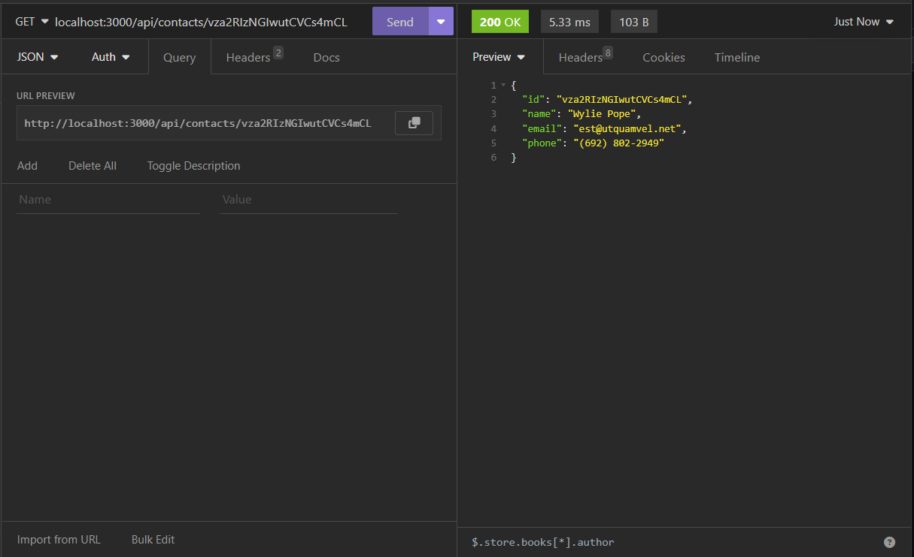
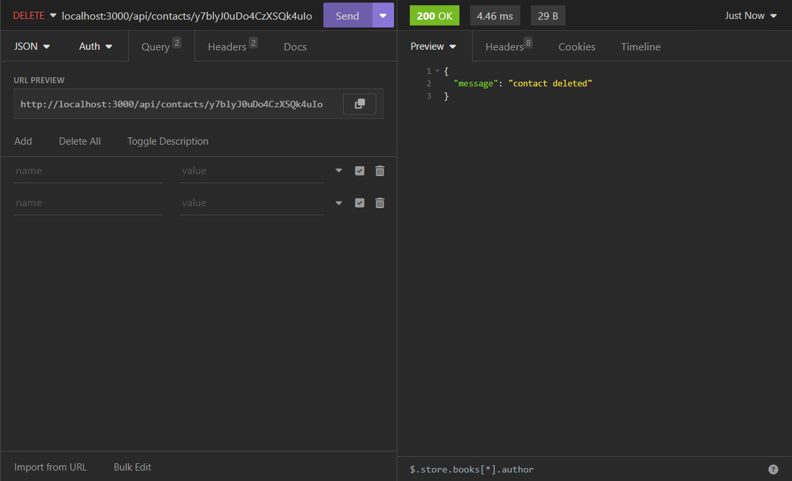

# Contact Management Application

A simple contact management application. It allows for adding, removing, listing, and searching contacts.

## hw-02-express

# Installation
## Clone repository:
```shell
git clone [repository-url]
```
## Change to the project directory:
```shell
cd [repository-name]

```
## Install and start:
```shell
npm install
```
## Start server:
```shell
node server.js
```

# Features
## Contact list:


## Find by id:


## Remove:
