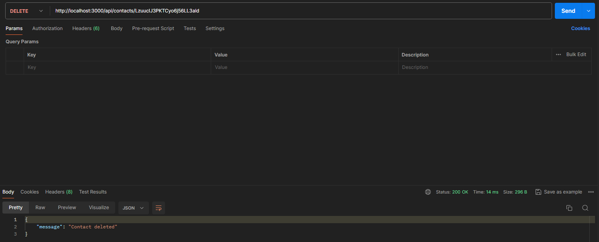

# Contacts CLI APP

---

## DEMO

### GET `http://localhost:3000/api/contacts`

### GET by ID `http://localhost:3000/api/contacts/CONTACT_ID`

### POST `http://localhost:3000/api/contacts/`

### PUT `http://localhost:3000/api/contacts/CONTACT_ID`

### DELETE `http://localhost:3000/api/contacts/CONTACT_ID`

---

## Technologies

- Node.js
- JavaScript

---

## Setup

Clone this repo to your desktop and run `npm install` to install all the dependencies.

---

## Usage

After you clone this repo to your desktop, go to its root directory and run `npm install` to install
its dependencies.

Once the dependencies are installed, you can run `npm run start:dev`

Open your browser or postman and check all available methods and endpoint's

- GET (contacts) : `http://localhost:3000/api/contacts`
- GET (find contact by id) : `http://localhost:3000/api/contacts/CONTACT_ID`
- POST (add new contact with json) : `http://localhost:3000/api/contacts/`
- PUT (update contact with json) : `http://localhost:3000/api/contacts/CONTACT_ID`
- DELETE (remove contact with unique id) : `http://localhost:3000/api/contacts/CONTACT_ID`

---

## Feel free to share your opinion

- https://www.linkedin.com/in/klima96/
