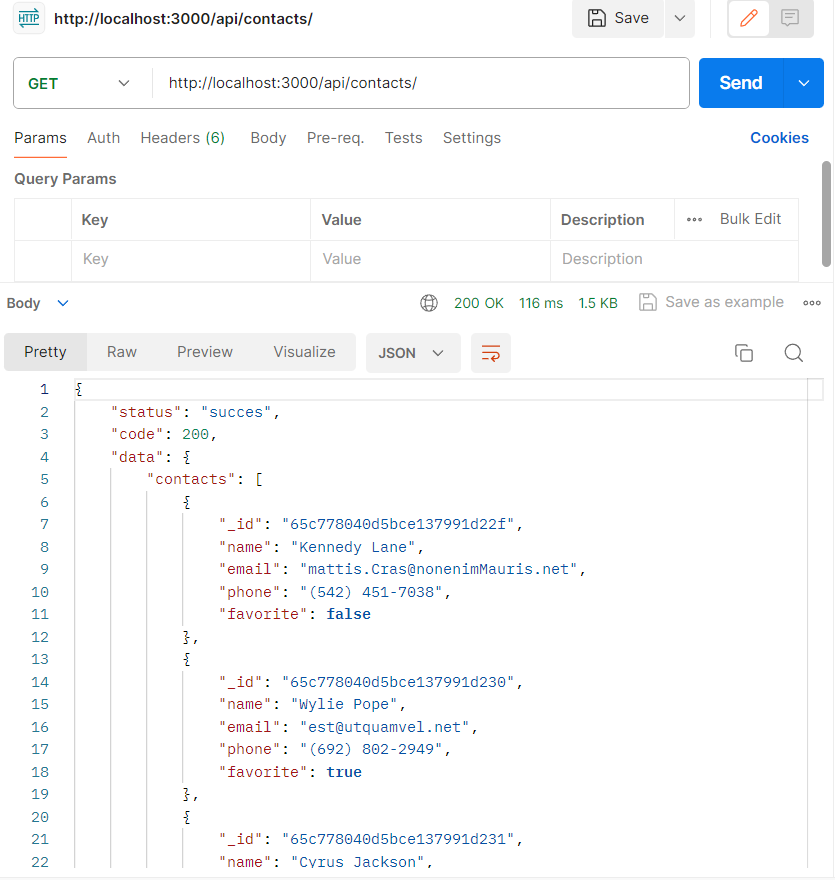
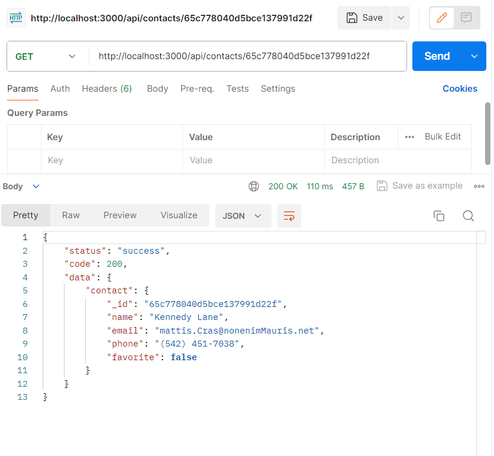
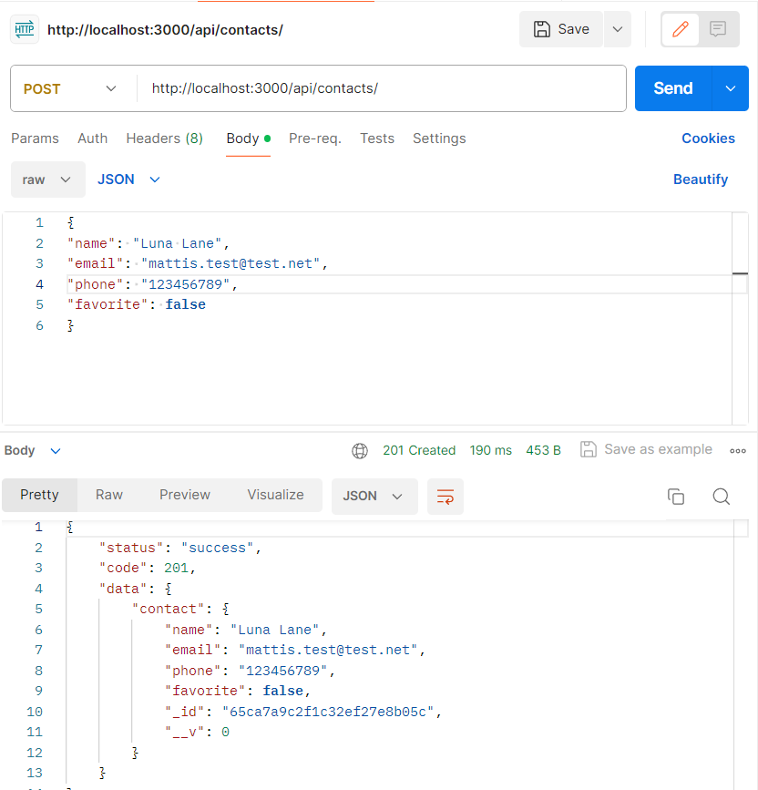
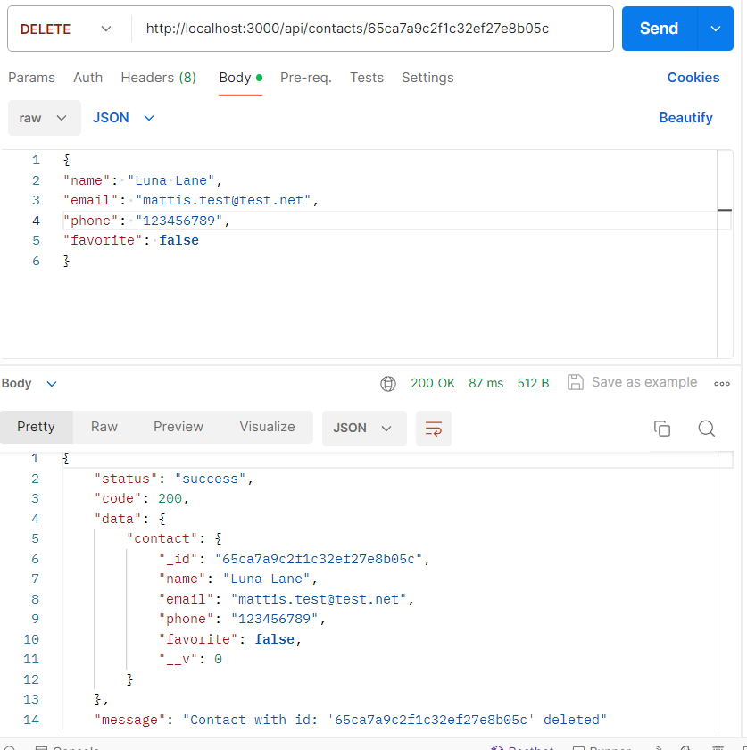
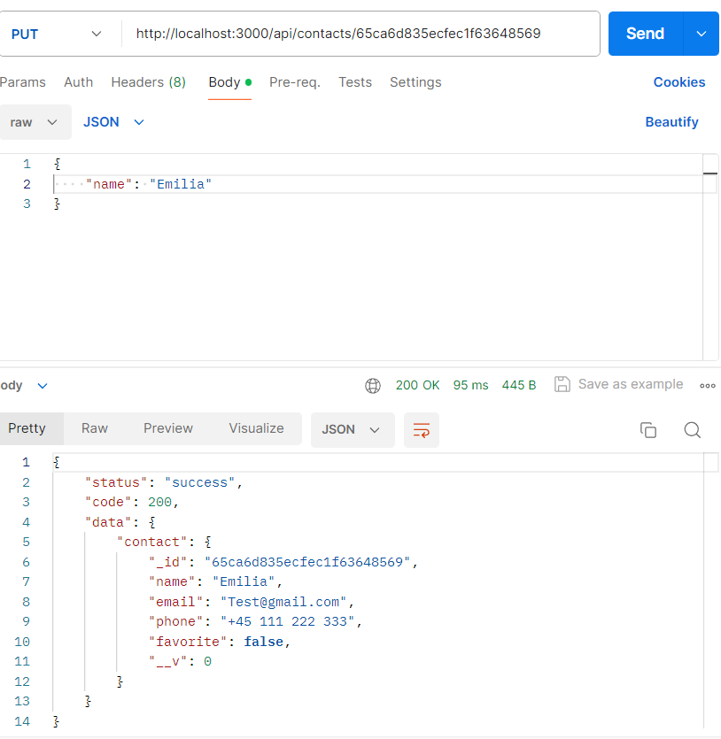

# CLI application

## Table of Contents

- [General Info](#general-information)
- [Technologies Used](#technologies-used)
- [Features](#features)
- [Setup](#setup)
- [Project Status](#project-status)
- [Acknowledgements](#acknowledgements)
- [Contact](#contact)
<!-- * [License](#license) -->

## General Information

- The aim of the task was to create a simple application for creating, deleting, and storing contacts using express and REST API.

## Technologies Used

Project is created with:

## Features

1.  GET `http://localhost:3000/api/contacts`

2. GET by ID `http://localhost:3000/api/contacts/CONTACT_ID`

3. POST `http://localhost:3000/api/contacts/`

4. DELETE `http://localhost:3000/api/contacts/CONTACT_ID`

5. PUT `http://localhost:3000/api/contacts/CONTACT_ID`

## Setup

Clone this repo to your desktop and run `npm install` to install all the dependencies.

Once the dependencies are installed, you can run `npm run start:dev`.

Open your browser or postman and check all available methods and endpoint's

- GET (get all contacts) : `http://localhost:3000/api/contacts`
- GET (find contact by id) : `http://localhost:3000/api/contacts/CONTACT_ID`
- POST (add new contact) : `http://localhost:3000/api/contacts/`
- DELETE (remove contact by id) : `http://localhost:3000/api/contacts/CONTACT_ID`
- PUT (update contact with json) : `http://localhost:3000/api/contacts/CONTACT_ID`

## Project Status

Project is: _finall_

## Acknowledgements

- Many thanks for GoIT Team.

## Contact

Feel free to contact with me: [@EmiliaWenta](https://www.linkedin.com/in/emilia-wenta-455782294/).
